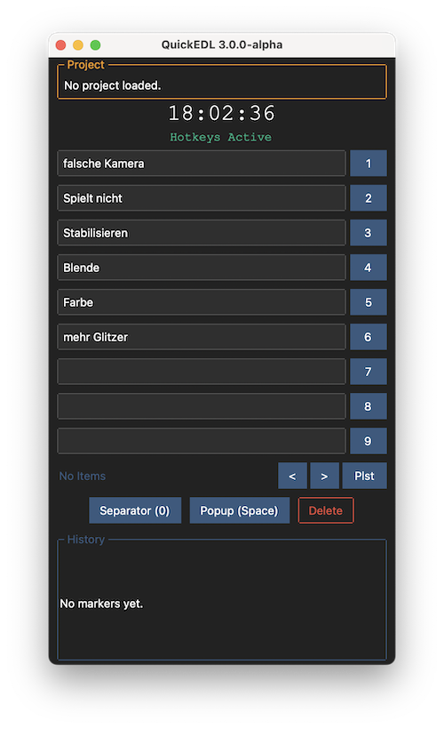

# QuickEDL

    

Simple application used at live video production to create a list with timestamps and comments similar to an *Edit Decision List (EDL)*.
Prefilled comments are chosen by button or hotkey and safed with timestamp in a TXT-file.

# How it works

## Terminology

***Markerlabels*** are textfields next to the ***marker buttons***. They are used as comment (or label) for the ***markers***.

***Markers*** are entries in the ***EDL-file***, containing the timestamp and the label.

The ***EDL-file*** is a simple text file saved in the project folder.

## creating markers
To edit the prepared labels, just click the textfield. Leave the field by hitting return or clicking anywhere in the window.
To write a timestamp with label to the edl fils, use the buttons next to the text field or using the number keys 1 to 9.

A separator is created with the key 0.

#### popup entry:
If you want to create a costum one time entry, use spacebar to open a window and enter a custom text. Return and Esc buttons will apply or abort the popup entry.
No matte how long you need for writing, as timestamp the moment of hitting space bar is used.

#### delete last entry:
With the delete button you can delete the last entry. For safety reasons the shortcut for this feature is deactivated by default. You can change this in the settings; have a look to the "Settings" sction below.

## Save & Load markerlabels
For saving and loading the content for the 9 prepared labels you can safe and load an additional txt file.
It basically reads the first 9 lines of a file. So it's possible to save them into the edl-list itself.

## Playlist entry (beta)
Playlist is used for marker you only need one time in a show (Song titles for example).The playlist is edited in the text menu. It is possible to save and load playist (simple `*.txt` file).

Once a playlist entry is used by clicking on the `Plst`-Button or hitting `P`, the next item in the playlist is automatically loaded.
You can navigate through the playlist labels using the arrow left and right keys.

### Delete last Marker:
With the delete button you can delete the last marker. For safety reasons the shortcut (backspace key) for this feature is deactivated by default. You can change this in the settings.

# Hotkeys
| Key | Function |
|:---:| --- |
| 1 to 9 | Markerbuttons 1 to 9 |
| 0 | Separator line |
| Space | Popup marker |
| P | Playlist marker |
| Backspace | Delete last marker (deactivated by default) |

# Settings
#### Funny Mode
When label fields are empty, some random funny labels are used (German only).

## Saving settings
Currently changing settings will not save them for the next time. When opened, QuickEDL will search for a folder named "quickedl" in you user directory and tries to read different files:
- `settings.yaml` to load user settings. Just edit the file directly; it's very simple and documented
- `texts.txt` to load users default markerlabels
- `quickedl.log` used as log file

Example files are found in the repository. In the settings window the expected path is shown as well as a confirmation, if the files are found and valid.

# Exporting Marker to Premiere Pro
It is possible to export the edl entries as sequence markers to **Adobe Premiere Pro** via an JSX script.

Unlikely there is still no way to execute them directly in Premiere Pro without useage of (paid) third party software.
But there is a free workaround using *VS Code*:
 
[How to use JSX-Script](docs/jsx.md)
