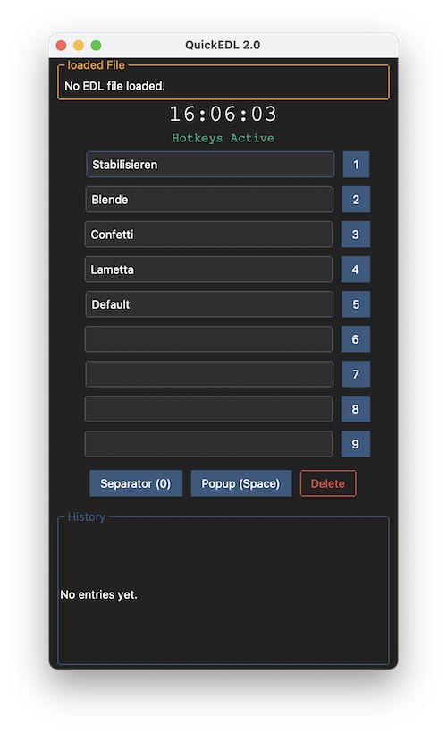

# QuickEDL

Simple application used at live video production to create a list with timestamps and comments similar to an *Edit Decision List (EDL)*.
Prefilled comments are chosen by button or hotkey and safed with timestamp in a txt-file.

# How it works

 ## create / open File
 The text file containing the marker is created or loaded first. All changed are saved directly to the file. There is no need of "safe file" at the end.

 ## making entries
 To edit the prepared labels, just click the textfield. Leave the field by hitting return or clicking anywhere in the window.
 To write a timestamp with label to the edl fils, use the buttons next to the text field or using the number keys 1 to 9.
 
 A separator is created with the key 0.

 #### popup entry:
 If you want to create a costum one time entry, use spacebar to open a window and enter a custom text. Return and Esc buttons will apply or abort the popup entry.
 No matte how long you need for writing, as timestamp the moment of hitting space bar is used.

 #### delete last entry:
 With the delete button you can delete the last entry. For safety reasons the shortcut for this feature is deactivated by default. You can change this in the settings; have a look to the "Settings" sction below.
 
 ## Save & Load texts
 For saving and loading the content for the 9 prepared labels you can safe and load an additional txt file.
 It basically reads the first 9 lines of a file. So it's possible to save them into the edl-list itself.

# Settings
#### Funny Mode
When label fields are empty, some random funny labels are used (German only).

## Saving settings
Currently changing settings will not save them for the next time. When opened, QuickEDL will search for a folder named "quickedl" in you user directory and tries to read different files:
- `settings.yaml` to load user settings. Just edit the file directly; it'S very simple and documented
- `texts.txt` to load users default labels
- `quickedl.log` used as log file

Example files are found in the repository. In the settings window the expected path is shown as well as a confirmation, if the files are found and valid.

# Exporting
 It is possible the export the edl entries as sequence markers to **Adobe Premiere Pro** via an JSX script.

 Unlikely there is still no way to execute them directly in Premiere Pro without useage of (paid) third party software.
 The easiest way is to open the jsx script in VSCode (free and open source) and "ExtendScript Debugger"-extension by Adobe, which can "evaluate" (sending) jsx-script commands to an Adobe target application.

# Development
- Simple Python 3.x application for Windows, macOS and Linux
- *ttkbootstrap* as GUI framework
- bundled with *pyinstaller*