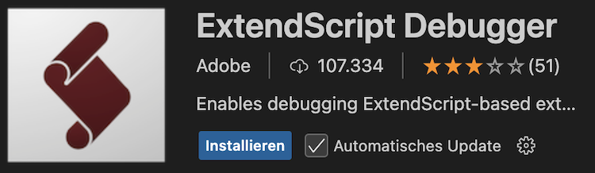

# JSX Export

Unlikely, Adobe do not allow to execute Extend Scripts directly inside the application. The workaround use Adobe's ExtendScript Debugger plugin for VSCode and let it execute the generated JSX script.

## Installation
- Install Visual Studio Code (VS Code) on the same system as Adobe Premiere Pro.
- Install the ExtendScript Debugger extension for VS Code. (Click on the Extensions icon in the Activity Bar on the left side of the window, search for the extension and click "install").
